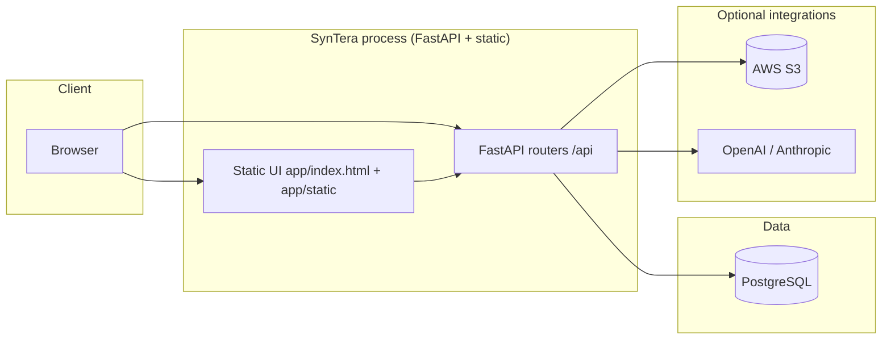
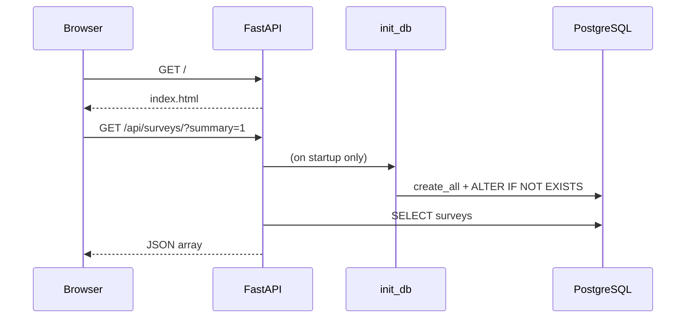
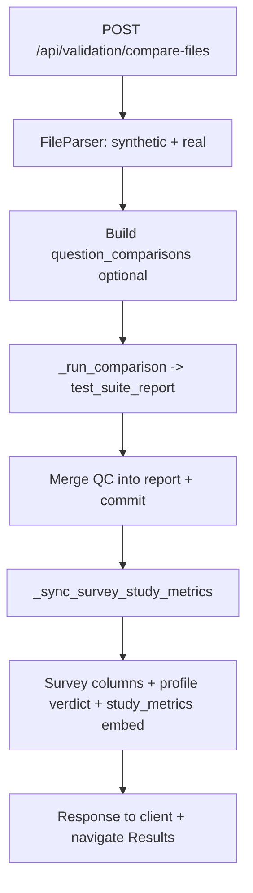

# SynTera Test Suite — Architecture

This document describes **how the system is structured**, **how requests flow**, and **where to change code**. Companion docs: [PRODUCT_WALKTHROUGH.md](PRODUCT_WALKTHROUGH.md), [INSTALLATION.md](INSTALLATION.md), [TEST_LAB_DATABASE_SCHEMA.md](TEST_LAB_DATABASE_SCHEMA.md).

---

## 1. High-level system context

- **Single deployable unit** today: one **FastAPI** app (`backend/main.py`) that serves **static files** (`/static`, optional `/brand`, `/omi`) and **JSON APIs** (`/api/...`).
- **Primary datastore**: **PostgreSQL** via SQLAlchemy (`database/connection.py`, models under `backend/models/`).
- **Optional**: **S3** for industry survey listing (`boto3`), **LLMs** for market research and simulation (`openai`, `anthropic`).

---

## 2. Repository layout (logical layers)

| Layer | Path | Role |
|-------|------|------|
| **Entry / HTTP** | `backend/main.py` | App factory, `lifespan` → `init_db()`, CORS, router mounts, `/` → `app/index.html`, `/health`. |
| **API surface** | `backend/routers/*.py` | REST endpoints grouped by domain. |
| **Domain logic** | `ml_engine/`, `backend/services/` | Statistical comparison, file parsing, simulation runtime, batch runners. |
| **Persistence** | `backend/models/`, `database/` | SQLAlchemy models; engine/session; `init_db()` DDL patches. |
| **Config** | `config/settings.py`, `config/parameter.py` | Pydantic settings from env; optional SSM parameter loading. |
| **Presentation** | `app/index.html`, `app/static/js/app.js`, `app/static/css/style.css` | SPA-style dashboard: sections, fetch calls, session storage for results. |
| **Deployment** | `deployment/docker-compose.yml`, `Dockerfile` | Container image (Python 3.11-slim) + Postgres sidecar example. |

---

## 3. FastAPI application composition

Routers are mounted in `backend/main.py`:

| Prefix | Module | Responsibility |
|--------|--------|----------------|
| `/api/auth` | `auth` | Login, JWT, privilege check, `/me`. |
| `/api/surveys` | `surveys` | CRUD-style survey list/create/get/delete; **`?summary=1`** list payload for dashboards. |
| `/api/validation` | `validation` | Compare runs, file compare, results, **Test Lab** profile upsert/get/batch, metrics, leads. |
| `/api/reports` | `reports` | Report download / formatting helpers. |
| `/api/market-research` | `market_research` | Long-running LLM extraction flows, uploads. |
| `/api/industry-surveys` | `industry_surveys` | S3 listing and related helpers. |
| `/api/simulation` | `simulation` | Simulation runtime + nightly batch endpoints. |

**Static mounts**

- `/static` → `app/static` (CSS, JS).
- `/brand`, `/omi` → optional brand and narrator video assets under `frontend/`.

---

## 4. Core runtime lifecycle

1. **Startup** (`lifespan`): `await init_db()` creates missing tables and applies **idempotent** `ALTER TABLE ... ADD COLUMN IF NOT EXISTS` for evolved schemas.
2. **Per request**: `get_db()` yields a SQLAlchemy session; routers read/write models and commit as needed.

---

## 5. Validation and Test Lab (deep dive)

### 5.1 Statistical engine

- **`ml_engine/comparison_engine.py`** — `ComparisonEngine` implements multiple tests (chi-square, KS, Mann–Whitney, correlations, etc.) and aggregates an **`overall_accuracy`** / tier-style summary into a **dict** persisted as `Survey.test_suite_report`.

### 5.2 File path

- **`ml_engine/file_parser.py`** — Parses Excel/CSV into structures used by `validation.compare_files`.
- **`validation.compare_files`** — Orchestrates parse, optional **question_comparisons** construction, `_run_comparison`, then merges QC into `test_suite_report`, calls **`_sync_survey_study_metrics`** to align **survey columns**, **embedded `study_metrics`**, and **rule-based verdict** on **`TestLabProfile`** (unless verdict is **manual**).

### 5.3 Test Lab profile API

- **`GET .../test-lab/profile/{id}`** — Ensures profile row exists, applies **`_ensure_profile_defaults`**, optionally **`_sync_survey_study_metrics`** when metrics are missing.
- **`GET .../test-lab/profiles/batch?survey_ids=...`** — Same for many IDs in one round-trip (used by the reports UI).
- **`POST .../test-lab/profile/{id}`** — Upsert human/synthetic/verdict/metadata with merge semantics.

Canonical ER diagram: [TEST_LAB_DATABASE_SCHEMA.md](TEST_LAB_DATABASE_SCHEMA.md).

---

## 6. Frontend architecture

- **No separate frontend build** (no Webpack in repo): the browser loads **vanilla JS** (`app/static/js/app.js`) from `/static/js/app.js`.
- **Navigation**: hash or section IDs (`showSection`) swap visible blocks in `app/index.html`.
- **API access**: `fetch('/api/...')` with optional `Authorization: Bearer` header from `localStorage`.
- **Performance patterns** (current): **cached survey list** (`fetchSurveysList`), **batched Test Lab profiles**, **`summary=1`** survey list to avoid huge JSON on first paint.
- **Session UX**: idle timeout + JWT expiry handling + `pageshow` re-check (see `app.js`).

---

## 7. Authentication and authorization

- **JWT** signed with `SECRET_KEY` (`python-jose`), expiry from `ACCESS_TOKEN_EXPIRE_MINUTES`.
- **`get_current_user` / `get_current_user_optional`** in `auth.py` decode Bearer tokens against the **`users`** table (`backend/models/user.py`).
- **Roles** (`UserRole`) gate privileged routes (e.g. super-only delete).

---

## 8. External configuration

- **`.env`** at repo root (loaded in `main.py` and `Settings`). Never commit secrets.
- **`config/parameter.py`** may hydrate additional secrets from **AWS SSM** in cloud environments (see code paths).

---

## 9. Observability and operations

- **Logging**: standard Python logging in routers and engine (`logging.basicConfig` in `main.py`).
- **Health**: `GET /health` returns JSON for probes (used in `Dockerfile` HEALTHCHECK).
- **DB audit script**: `scripts/audit_test_lab_db.py` — optional CI in `.github/workflows/test-lab-db-audit.yml`.

---

## 10. Extension points (where to add features)

| Goal | Likely touch points |
|------|---------------------|
| New API | New `backend/routers/*.py` + `include_router` in `main.py`. |
| New persisted field | `backend/models/*.py` + `database/connection.py` `init_db` ALTERs + [TEST_LAB_DATABASE_SCHEMA.md](TEST_LAB_DATABASE_SCHEMA.md). |
| New UI section | `app/index.html` structure + `app/static/js/app.js` + `app/static/css/style.css`. |
| New statistical test | `ml_engine/comparison_engine.py` + wire into aggregation. |
| New LLM provider | `backend/utils/llm_gateway.py` / market research or simulation callers + `config/settings.py`. |

---

## 11. Diagram: validation file compare (simplified)

This architecture is intentionally **modular monolith**: one process, clear router boundaries, shared Postgres, optional cloud keys for advanced tabs.
